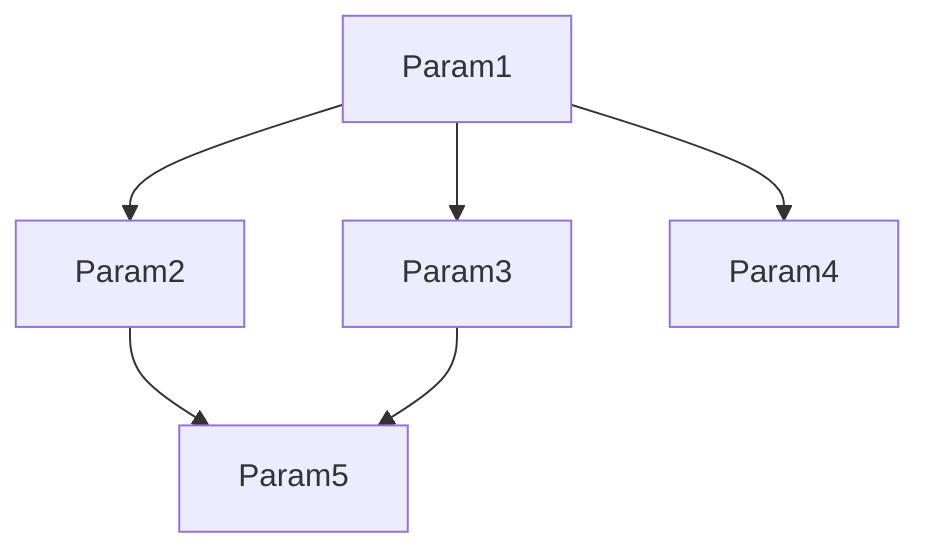

# Jenkins Active Choices Plugin Parameter Rendering Bug Fix

## Summary

This repository contains the files necessary for building, testing, and
applying a bug fix to the Jenkins Active Choices Plugin.
The bug fix has been tested and verified to work with AC plugin version 2.8.1.

The bug is related to the problem with the parameter value rendering for
cascading parameters in the Jenkins Active Choices Plugin.
This problem has been documented and discussed in the following Jenkins JIRA
issues:

* [JENKINS-71909](https://issues.jenkins.io/browse/JENKINS-71909)
* [JENKINS-72826](https://issues.jenkins.io/browse/JENKINS-72826)
* [JENKINS-73239](https://issues.jenkins.io/browse/JENKINS-73239)

## The Problem

The bug caused cascading parameters (dynamic parameters + dynamic reference
parameters) not to render correctly - the parameter values not being updated
during the build UI interaction due to the lack of proper change propagation
logic in the plugin.

The author's suspicion is that the root cause of the problem is most likely
in one of the following:

* [_UnoChoice_ frontend code](https://github.com/jenkinsci/active-choices-plugin/blob/master/src/main/resources/org/biouno/unochoice/stapler/unochoice/UnoChoice.es6)
  * `CascadeParameter.update()` / `DynamicReferenceParameter.update()` methods
    * The methods returning prematurely due to incorrect use of asynchronous
          calls (e.g. `Promise` objects)
  * `proxy.doUpdate()` method
    * Potentially similar issues as stated above
* [Plugin Java code](https://github.com/jenkinsci/active-choices-plugin/blob/master/src/main/java/org/biouno/unochoice/AbstractCascadableParameter.java)
  * `AbstractCascadableParameter.update()` method

What is important to note is that the key problem is the clash between the
parameter rendering timing which results in the wrong order of parameter
rendering and the lack of proper change propagation logic in the plugin.

## The solution (workaround)

The bugfix is applied by using [the build script](./build.sh) provided in this
repository to rebuild / patch the Jenkins Active Choices Plugin.

The patch appends the necessary logic to one of the plugin's JavaScript files.
It does so by adding a new `DOMContentLoaded` event listener to the `window`
object, which ensures that the logic is executed after the initial page load.

The code forces the consecutive update of dependent parameters both during the
initial page load and on parameter value changes. It achieves this by
utilizing the smart logic:

* topologically sorts the parameters, ensuring they are updated in the correct
  order
* tracks the updates with the clever trick which tracks the use log messages
  (parses the log messages to determine the status of the update(s))
* listens for changes to the parameters and ensures proper propagation of
  values to their dependencies
* (optionally) handles the visibility during updates to improve the user
  experience

For more technical details into the script's logic,
refer to the comment-based documentation
[in the JavaScript file](./assets/UnoChoice.append.js).

### Why not distributed as a full repository fork?

This bugfix is distributed as a patch for the existing Acive Choices plugin
bundles. There are multiple valid reasons for this:

1. **Maintainability**
    * Maintaining a private fork of the plugin would require
      constant synchronization with the upstream repository. This is problematic
      since the plugin is actively developed and maintained.
3. **Compatibility**
    * The plugin is actively developed and maintained, and the code changes
      related to the bugfix may not be compatible with the latest versions of
      the plugin, requiring problematic rebasing and merge conflict resolution.
4. **Simplicity**
    * The patching process is simple and straightforward, requiring only a
      few commands to apply the bugfix.
    * The provided script provides an automated way to build, test, and install
      the patched plugin.
5. **Flexibility**
    * The patching process allows specifying the version of the plugin to
      apply the bugfix to, ensuring compatibility with the existing Jenkins
      installations.
    * Custom Jenkins instance URL can be provided to the script to install the
      patched plugin.
5. **Security**
    * The patching process ensures that the bugfix is applied to the plugin
      without any additional changes, ensuring the security and integrity of
      the plugin.
6. **Transparency**
    * The patching process is transparent and open-source, allowing anyone to
      inspect the changes and apply them to their own installations.

In addition to the above-stated reasons, the nature of the bugfix is such that
it requires a minimal amount of changes to the plugin codebase, making it
suitable for a patch-based distribution. Also, since the logic contains a
workaround for the problem, it is not a permanent solution, but rather a
temporary fix until the plugin maintainers fully address the root cause of the
issue.

## Known issue(s)

### Slow(er) initial page load on complex pipelines

There have been some reports related to an issue that affects particular
complex pipelines. In such pipelines, the initial page load takes
somewhat longer to complete due to amplified cascading parameter updates.
Those dynamic parameters usually contain complex (and longer running) logic
attached to them, which causes the page to load slowly.

Let's visualize this problem with an example:



As you can see, in the example above, multiple parameters depend on `Param5`.
Due to the way the exposed plugin API works (primarily the `update()` method),
the plugin will update `Param5` multiple times.
This is because we cannot perform an isolated update of a parameter without
updating its dependencies, nor utilizing any caching mechanism to prevent
redundant updates.

The overall effect can lead to amplified loading times during the initial
page load, especially when the parameter logic, the network connection,
or the server itself is slow.
And, of course, the larger the number of such dependent parameters,
the longer the page load time.

## Usage

Please refer to the detailed usage instructions by running:

```shell
./script.sh --help
```

### Building the Plugin

Simply run `./script.sh build` to build the plugin.

To specify the version of the plugin to build, use the `--version` option:

```shell
./script.sh build --version 2.8.1
```

Additionally, please refer to the detailed usage instructions by running:

```shell
./script.sh build --help
```

### Installing the Plugin

Simply run `./script.sh install` to install the plugin.

To specify the host, credentials, plugin file and restart flag, use the
following command:

```shell
./script.sh install \
    --host http://10.0.0.1:8080 \
    --credentials admin:admin \
    --plugin-file build/uno-choice.hpi \
    --restart
```

Additionally, please refer to the detailed usage instructions by running:

```shell
./script.sh install --help
```

Alternatively, you can manually install the plugin by navigating through the
Jenkins web interface:

_Dashboard_ > _Manage Jenkins_ > _Manage Plugins_ > _Advanced_ > _Upload Plugin_

Or by navigating to the following URL:

```text
<your-jenkins-url>/manage/pluginManager/advanced
```
